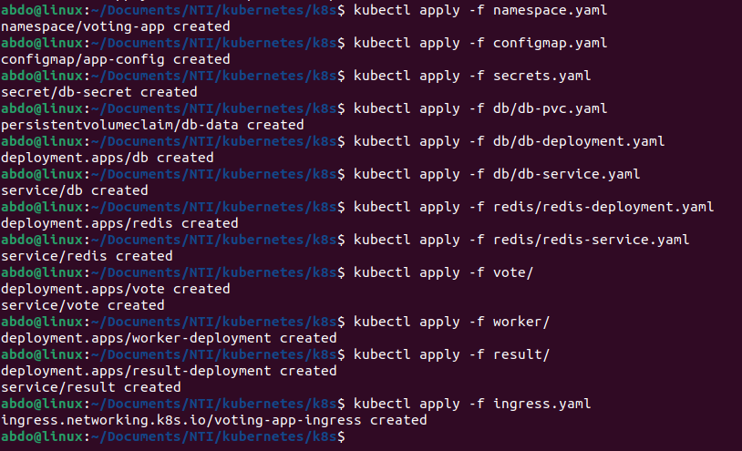

# Kubernetes Example Voting App — DevOps Project

This project is a full **microservices-based voting application** deployed on **Kubernetes (Minikube)**.

It’s based on Docker’s official [example-voting-app](https://github.com/dockersamples/example-voting-app), but structured to demonstrate **Kubernetes concepts**, **Secrets**, **ConfigMaps**, **Ingress**.

---

## Project Description


The application consists of **5 main microservices**:

| Service | Description | Technology |
|----------|--------------|-------------|
| `vote` | Frontend web app for voting | Python / Flask |
| `db` | Stores the voting results | PostgreSQL |
| `redis` | Caches incoming votes | Redis |
| `worker` | Processes votes from Redis and stores in PostgreSQL | .NET |
| `result` | Frontend web app for displaying results | Node.js |

---

## Project Structure

```
- **k8s/**
  - **namespace.yaml** → defines the namespace for the app  
  - **configmap.yaml** → contains configuration values  
  - **secrets.yaml** → stores sensitive data (like DB credentials)  
  - **db/**
    - **db-pvc.yaml** → persistent storage for PostgreSQL  
    - **db-deployment.yaml**  
    - **db-service.yaml** 
  - **redis/**
    - **redis-deployment.yaml** 
    - **redis-service.yaml** 
  - **vote/**
    - **vote-deployment.yaml** → frontend for voting  
    - **vote-service.yaml** 
  - **worker/**
    - **worker-deployment.yaml** → background worker for processing votes  
  - **result/**
    - **result-deployment.yaml** → frontend showing voting results  
    - **result-service.yaml** 

```

---

## Prerequisites

Make sure you have the following installed:

- [Minikube](https://minikube.sigs.k8s.io/docs/start/)
- [Kubectl](https://kubernetes.io/docs/tasks/tools/)
- Basic knowledge of Kubernetes YAML files

---

## Step 1 — Start Minikube

```bash
minikube start
```

Check cluster info:

```bash
kubectl cluster-info
```

---

## Step 2 — Deploy to Kubernetes

Apply all manifests inside `k8s/` namespace:

```bash
kubectl create namespace voting-app
kubectl apply -f k8s/ -n voting-app
```


Check all running pods:

```bash
kubectl get pods -n voting-app
```

Expected output:

```
NAME                                 READY   STATUS    RESTARTS   AGE
db-b4cc7765b-jbq6k                   1/1     Running   0          1m
redis-7b986b9f57-vpk8h               1/1     Running   0          1m
vote-57d568496f-sf8wv                1/1     Running   0          1m
worker-deployment-7fc4b4f884-l4wmt   1/1     Running   0          1m
result-deployment-bccdd858b-n8knw    1/1     Running   0          1m
```

---

## Step 3 — Access the App

### Option 1: Using Port Forwarding

**Vote frontend:**
```bash
kubectl port-forward svc/vote 5000:80 -n voting-app
```
Open: [http://localhost:5000](http://localhost:5000)

**Result frontend:**
```bash
kubectl port-forward svc/result 5001:80 -n voting-app
```
Open: [http://localhost:5001](http://localhost:5001)

---


### Option 2: Using Ingress (Recommended)

Enable ingress on Minikube:
```bash
minikube addons enable ingress
```

Then apply:
```bash
kubectl apply -f k8s/ingress.yaml -n voting-app
```

Get Minikube IP:
```bash
minikube ip
```

Add this line to `/etc/hosts` (replace `<minikube-ip>`):
```
<minikube-ip>   vote.local result.local
```

Now open:
- [http://vote.local](http://vote.local)
- [http://result.local](http://result.local)


## Step 4 — Cleanup

To remove everything:

```bash
kubectl delete namespace voting-app
```

---

## Key Kubernetes Concepts Used

- **Deployments**: To manage replicas and rolling updates  
- **Services**: To expose internal and external traffic  
- **Secrets & ConfigMaps**: To manage sensitive data and configs  
- **PVC (PersistentVolumeClaim)**: To store PostgreSQL data  
- **Ingress**: To expose multiple apps on a single Minikube IP  

---

## Future Improvements

- Add **Monitoring** (Prometheus + Grafana)
- Automate CI/CD using **GitHub Actions**
- Add **TLS (HTTPS)** to Ingress using self-signed certificates
- Deploy on **Cloud (EKS / GKE / AKS)**

---

## Author

**Abd-Alrahman Ashraf** -- DevOps Engineer 

 Passionate about automation, cloud, and infrastructure as code.

---

## 📝 License

This project is open-source and available under the [MIT License](LICENSE).
